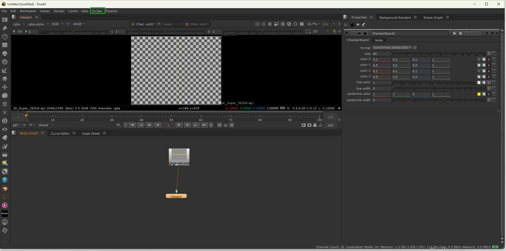
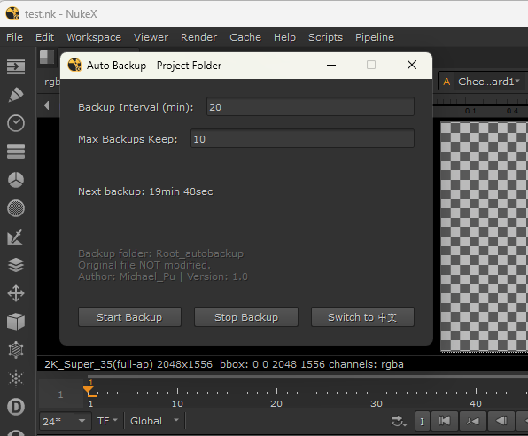

# Nuke Auto‑Backup Plugin
A Python pipeline tool for The Foundry Nuke, preventing work loss caused by unexpected Nuke crashes.

## Overview
After you save your Nuke script, the backup will start automatically.
By default it runs every 20 minutes.
Backups are stored inside a separate `*_autobackup` folder created within your current project directory.

You can custom‑configure the backup interval and maximum number of backup files to keep.

### Features
- Manual start/stop backup via UI panel
- Auto‑trigger backup after script save, default 20‑minute interval
- Customizable backup interval and maximum number of backup files
- Creates a dedicated sub‑folder in your project directory to store backup `.nk` files
- Rolling backup version management to limit total backup count
- Bilingual UI support (English / Chinese)

> Note: Auto‑start only works if your Nuke script has been saved to disk. Unsaved untitled scripts will skip backup.

## Compatibility
Tested on Nuke 14 / 15 / 16 (PySide6)

## Installation
### Method 1: Install to Nuke .nuke folder (Recommended)
1. Place `nuke_auto_backup.py` into your `.nuke` folder.
2. Locate your existing `menu.py` inside `.nuke` folder:
   - If `menu.py` exists: Open `menu.py` with Notepad. Copy the code block below and append it on a new line at the end of your `menu.py`.
   - If `.nuke` or `menu.py` does not exist: Create the folder/file and paste the code.

```python
import nuke
import nuke_auto_backup
```

3. Restart Nuke.
   - Built‑in entry: `Scripts > Auto Backup` (added by nuke_auto_backup.py itself)
   
### Method 2: Custom plugin folder

Place all files inside a custom plugin directory and add the folder path to your Nuke plugin‑path.

## How to use

After successful installation, launch the panel from the built‑in menu:

Built‑in entry: `Scripts > Auto Backup`



Open the Auto‑Backup panel:



After you save your Nuke script, the backup will start automatically. By default it runs every 20 minutes.
Backups are stored inside a separate `*_autobackup` folder created within your current project directory.

You can custom‑configure the backup interval and maximum number of backup files to keep.

> 
> Note: Auto‑start only works if your Nuke script has been saved to disk. Untitled unsaved scripts will skip backup.

## Tech Stack

Python, Nuke SDK, PySide6, threading, json

## License

MIT
